# Foundr Vignette

``` r

library(dplyr)
```

    ## 
    ## Attaching package: 'dplyr'

    ## The following objects are masked from 'package:stats':
    ## 
    ##     filter, lag

    ## The following objects are masked from 'package:base':
    ## 
    ##     intersect, setdiff, setequal, union

``` r

library(ggplot2)
library(foundr)
```

    ## Registered S3 method overwritten by 'ordr':
    ##   method              from 
    ##   ggplot_add.LayerRef gggda

### Sample Data

``` r

sampleSignal <- partition(sampleData)
```

``` r

sampleStats <- strainstats(sampleData)
sampleStats %>%
  filter(term == "signal")
```

    ## # A tibble: 4 × 5
    ##   dataset trait term      SD p.value
    ##   <chr>   <chr> <chr>  <dbl>   <dbl>
    ## 1 sample  C     signal 1.16  0.00228
    ## 2 sample  A     signal 1.07  0.300  
    ## 3 sample  D     signal 0.785 0.666  
    ## 4 sample  B     signal 0.796 0.126

- C on A: mostly signal
  - mean cor = 0.0107; signal cor = 0.90
  - -10\*log(p.value) = 1.97, 2.81
- D on B: negligible signal
  - mean cor = 0.8110; signal cor = 0.28
  - -10\*log(p.value) = 0.32, 2.73

### Scatterplots

``` r

out <- traitSolos(sampleData, sampleSignal,
                  response = "value")
plot(out)
```

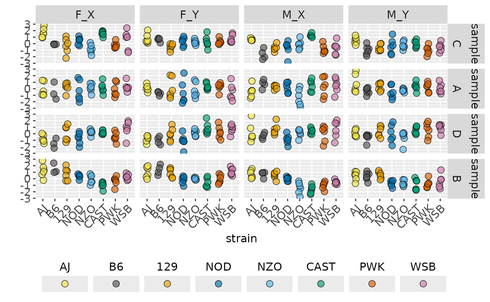

``` r

plot(out, facet_strain = TRUE)
```

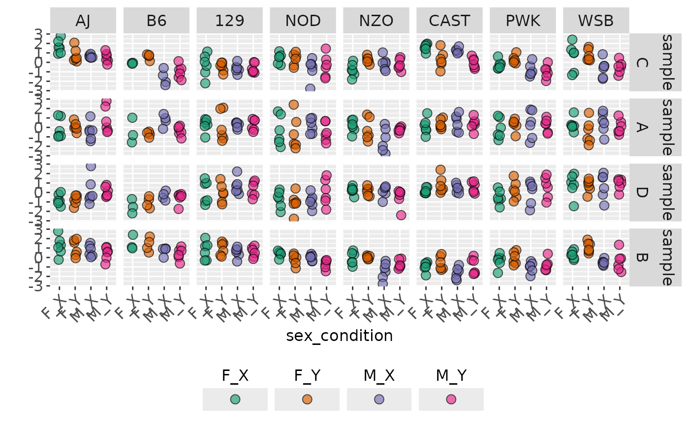

``` r

out2 <- traitPairs(
  out,
  traitnames = attr(out, "traitnames"),
  pair = c(
    paste(attr(out, "traitnames")[1:2], collapse = " ON "),
    paste(attr(out, "traitnames")[3:4], collapse = " ON ")))
plot(out2, parallel_lines = TRUE)
```

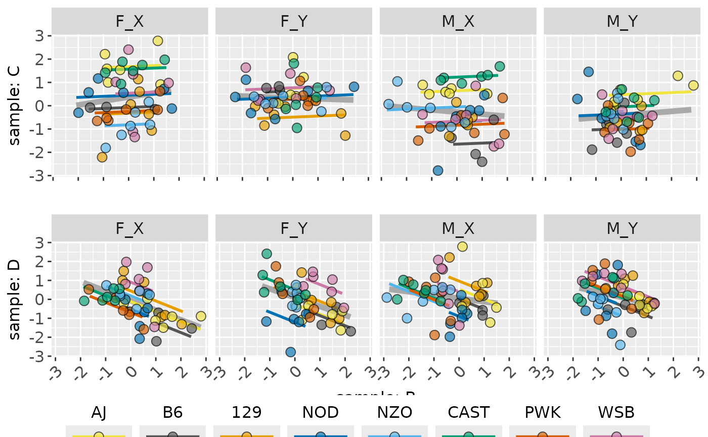

``` r

plot(out2, facet_strain = TRUE)
```

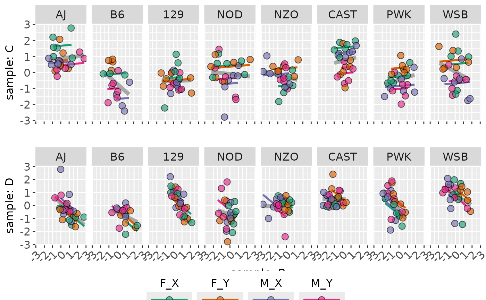

``` r

plot(out2, facet_strain = TRUE, parallel_lines = FALSE)
```

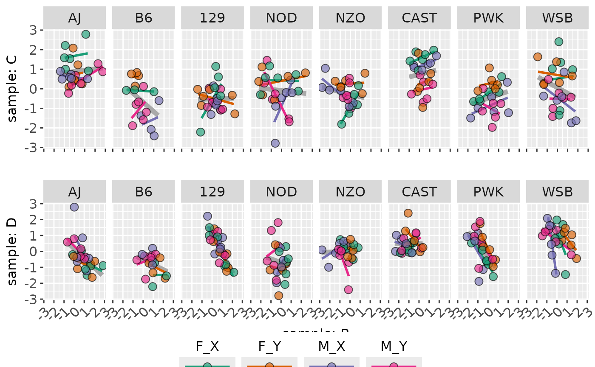

##### Plots of Means

``` r

out <- traitSolos(sampleData, sampleSignal,
                  response = "cellmean")
summary(out)
```

    ## # A tibble: 16 × 12
    ##    dataset sex   condition trait      AJ      B6   `129`     NOD     NZO    CAST
    ##    <fct>   <chr> <chr>     <fct>   <dbl>   <dbl>   <dbl>   <dbl>   <dbl>   <dbl>
    ##  1 sample  F     Y         C      0.752   0.599  -0.487   0.342   0.258   0.316 
    ##  2 sample  F     X         C      1.67   -0.0951 -0.307   0.432  -0.812   1.58  
    ##  3 sample  M     X         C      0.625  -1.62   -0.648  -0.681  -0.114   1.25  
    ##  4 sample  M     Y         C      0.508  -1.00   -0.626  -0.380  -0.254  -0.0314
    ##  5 sample  F     Y         A      0.0706 -0.708   0.0666 -0.589  -0.217   0.334 
    ##  6 sample  F     X         A     -0.115  -0.459   0.256  -0.351   0.136   0.114 
    ##  7 sample  M     X         A     -0.420   0.733   0.258   0.167  -1.34    0.494 
    ##  8 sample  M     Y         A      0.792  -0.365   0.264  -0.510  -0.225   0.354 
    ##  9 sample  F     Y         D     -0.798  -1.04   -0.0708 -1.09    0.130   0.826 
    ## 10 sample  F     X         D     -0.763  -1.48    0.0542 -0.723   0.225   0.174 
    ## 11 sample  M     X         D      0.161  -0.356   0.673  -0.888   0.105   0.416 
    ## 12 sample  M     Y         D      0.0674 -0.569   0.324   0.0306 -0.527   0.542 
    ## 13 sample  F     Y         B      1.03    1.35    0.930  -0.216   0.0136 -0.604 
    ## 14 sample  F     X         B      1.22    1.49    0.738   0.384  -0.0764 -0.956 
    ## 15 sample  M     X         B      0.712   0.686   0.552  -0.0174 -1.42   -1.65  
    ## 16 sample  M     Y         B      0.434   0.382   0.576  -0.712  -0.714  -0.912 
    ## # ℹ 2 more variables: PWK <dbl>, WSB <dbl>

``` r

plot(out)
```

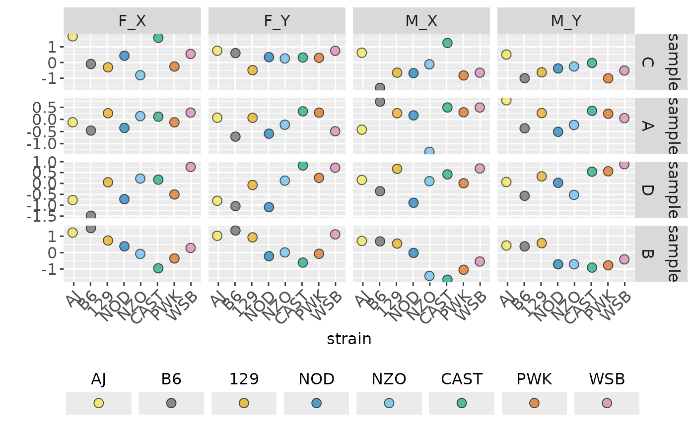

``` r

ggplot_traitSolos(out)
```

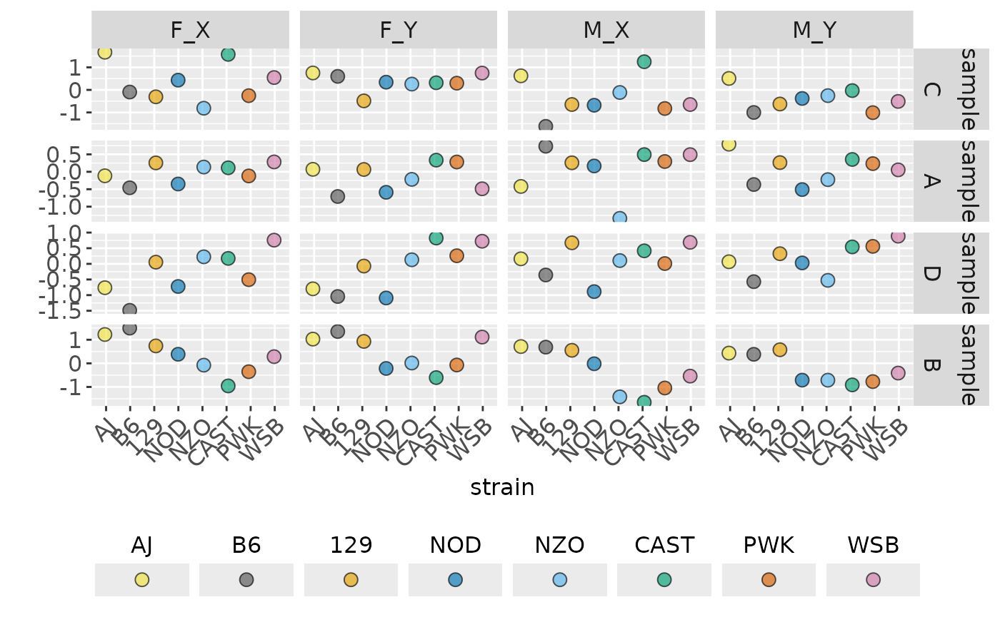

``` r

out2 <- traitPairs(
  out,
  traitnames = attr(out, "traitnames"),
  pair = c(
    paste(attr(out, "traitnames")[1:2], collapse = " ON "),
    paste(attr(out, "traitnames")[3:4], collapse = " ON ")))
plot(out2, parallel_lines = TRUE)
```

    ## Warning in ggplot2::geom_line(ggplot2::aes(y = .data$.fitted), span = span, : Ignoring unknown parameters: `span`
    ## Ignoring unknown parameters: `span`

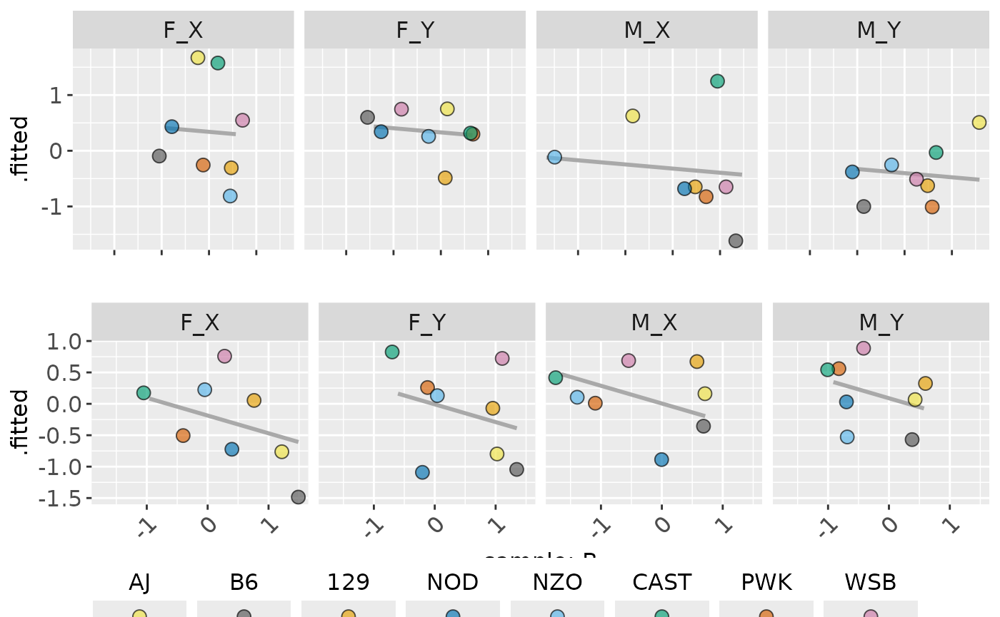

``` r

ggplot_traitPairs(out2, parallel_lines = FALSE)
```

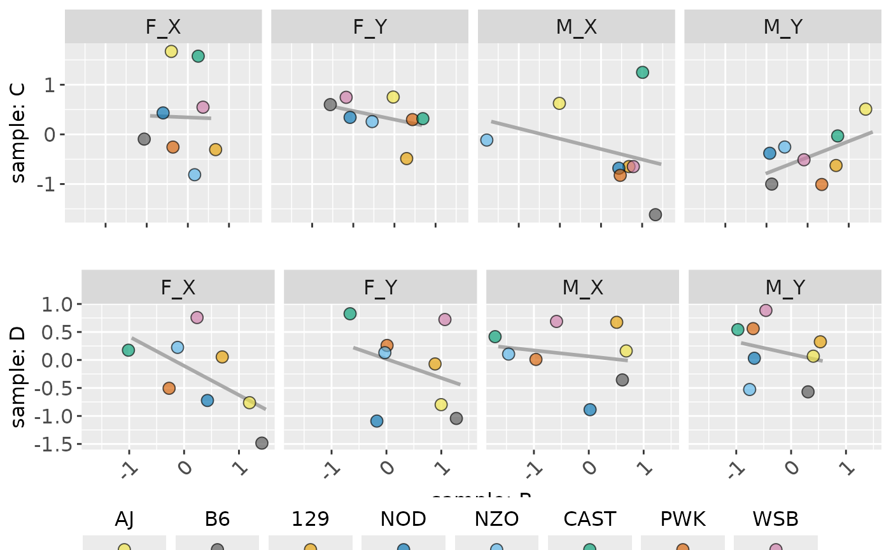

``` r

out <- traitSolos(sampleData, sampleSignal,
                  response = "signal")
plot(out)
```

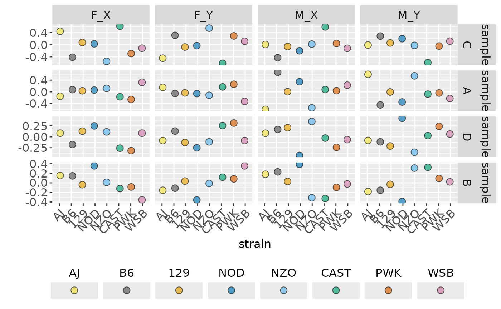

``` r

out2 <- traitPairs(
  out,
  traitnames = attr(out, "traitnames"),
  pair = c(
    paste(attr(out, "traitnames")[1:2], collapse = " ON "),
    paste(attr(out, "traitnames")[3:4], collapse = " ON ")))
plot(out2)
```

    ## Warning in ggplot2::geom_line(ggplot2::aes(y = .data$.fitted), span = span, : Ignoring unknown parameters: `span`
    ## Ignoring unknown parameters: `span`

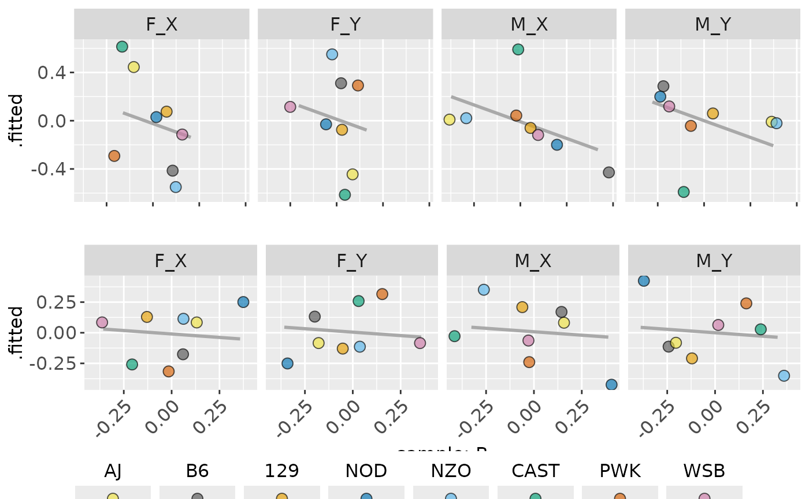

## Correlations and Effects

``` r

volcano(sampleStats, "signal")
```

    ## Warning: Removed 3 rows containing missing values or values outside the scale range
    ## (`geom_text_repel()`).

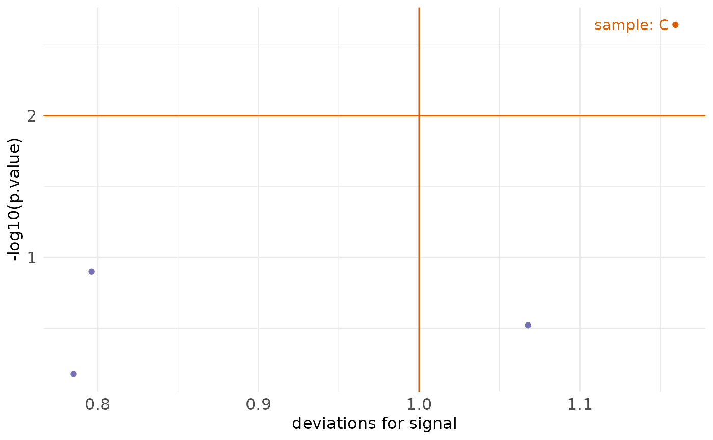

``` r

summary(sampleStats)
```

    ## # A tibble: 4 × 5
    ##   dataset trait term             deviance log10.p
    ##   <chr>   <chr> <chr>               <dbl>   <dbl>
    ## 1 sample  C     strain               2.18    8.66
    ## 2 sample  B     strain               1.83    7.32
    ## 3 sample  C     strain:condition     1.35    2.77
    ## 4 sample  D     strain               1.55    2.40

``` r

summary(sampleStats, "deviation", "parts")
```

    ## # A tibble: 128 × 6
    ##    dataset strain sex   condition trait   value
    ##    <fct>   <fct>  <chr> <chr>     <fct>   <dbl>
    ##  1 sample  B6     F     Y         C      0.311 
    ##  2 sample  B6     F     X         C     -0.414 
    ##  3 sample  B6     M     X         C     -0.429 
    ##  4 sample  B6     M     Y         C      0.286 
    ##  5 sample  129    M     X         C     -0.0601
    ##  6 sample  129    F     X         C      0.0751
    ##  7 sample  129    F     Y         C     -0.0751
    ##  8 sample  129    M     Y         C      0.0601
    ##  9 sample  AJ     F     X         C      0.445 
    ## 10 sample  AJ     F     Y         C     -0.445 
    ## # ℹ 118 more rows

``` r

summary(sampleStats, "log10.p", "terms")
```

    ## # A tibble: 128 × 6
    ##    dataset strain sex   condition trait   value
    ##    <fct>   <fct>  <chr> <chr>     <fct>   <dbl>
    ##  1 sample  B6     F     Y         C      0.311 
    ##  2 sample  B6     F     X         C     -0.414 
    ##  3 sample  B6     M     X         C     -0.429 
    ##  4 sample  B6     M     Y         C      0.286 
    ##  5 sample  129    M     X         C     -0.0601
    ##  6 sample  129    F     X         C      0.0751
    ##  7 sample  129    F     Y         C     -0.0751
    ##  8 sample  129    M     Y         C      0.0601
    ##  9 sample  AJ     F     X         C      0.445 
    ## 10 sample  AJ     F     Y         C     -0.445 
    ## # ℹ 118 more rows

``` r

summary(sampleStats, "log10.p", "terms", threshold = NULL)
```

    ## # A tibble: 128 × 6
    ##    dataset strain sex   condition trait   value
    ##    <fct>   <fct>  <chr> <chr>     <fct>   <dbl>
    ##  1 sample  B6     F     Y         C      0.311 
    ##  2 sample  B6     F     X         C     -0.414 
    ##  3 sample  B6     M     X         C     -0.429 
    ##  4 sample  B6     M     Y         C      0.286 
    ##  5 sample  129    M     X         C     -0.0601
    ##  6 sample  129    F     X         C      0.0751
    ##  7 sample  129    F     Y         C     -0.0751
    ##  8 sample  129    M     Y         C      0.0601
    ##  9 sample  AJ     F     X         C      0.445 
    ## 10 sample  AJ     F     Y         C     -0.445 
    ## # ℹ 118 more rows

``` r

effectplot(sampleStats, trait_names(sampleStats, "C"))
```

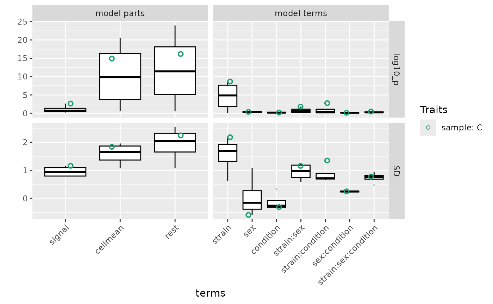

## Shiny App

This package is equiped with a default app in
[inst/shinyApp/app.R](https://github.com/byandell/foundr/blob/main/inst/shinyApp/app.R).
Other applied apps can be found in
<https://github.com/byandell/FounderCalciumStudy> and
<https://github.com/byandell/FounderDietStudy>. Users can deploy their
own version of apps.

More is needed here to explain the steps to set up:

- harmonize data with
  [harmonize()](https://github.com/byandell/foundr/blob/main/R/harmonize.R);
  see example in
  <https://github.com/byandell/FounderCalciumStudy/blob/main/DataHarmony.Rmd>.
- customize app.r; see example in
  <https://github.com/byandell/FounderCalciumStudy/blob/main/app.R> with
  components
  - install packages for the deployment platform that are not already
    present
  - read in trait data created in harmonize step
  - set `customSettings`
  - provide custom title to `foundr::foundrUI()`
