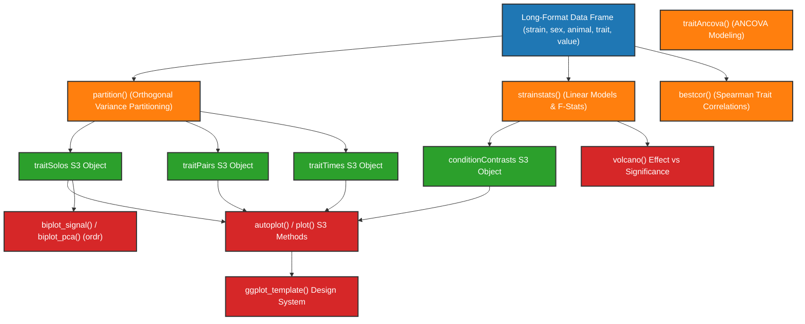

```{r, include = FALSE}
knitr::opts_chunk$set(
  collapse = TRUE,
  comment = "#>"
)
```

# foundr Developer Guide Overview & Architecture

## Package Purpose & Ecosystem

**foundr** is an R package for analyzing and visualizing multiparent founder study data (specifically Collaborative Cross founder mouse crosses). It provides core statistical decomposition models, strain effect estimation, S3 trait object encapsulation, and customizable `ggplot2` visualizations.

- **Author:** Brian S. Yandell (<brian.yandell@wisc.edu>)
- **License:** GPL-3
- **Minimum R Version:** ≥ 4.2.0

Related packages in the ecosystem:
- **`foundr`**: Core data analysis algorithms, variance partitioning, statistical summaries, S3 trait classes, and plotting functions.
- **`foundrShiny`**: Interactive Shiny web application providing modular UI components and reactive analysis panels.
- **`foundrHarmony`**: Data harmonization across multi-tissue study datasets (in development).
- **`modulr`**: Standardization and harmonization of WGCNA module objects.

---

## High-Level Package Architecture & Data Flow

The `foundr` package structures founder data processing into an end-to-end analytical pipeline:



---

## Developer Quick Start

### Local Development Workflow

```r
# Load local package sources dynamically
devtools::load_all()

# Re-generate documentation & NAMESPACE
devtools::document()

# Run R package checks
devtools::check(vignettes = FALSE)
```

### Navigating the Guide

For detailed information on individual function groups, parameter handling, and statistical modeling algorithms, explore the sub-guides:

- **[Function Index & S3 Class System Breakdown](modules.html)**: Categorized listing of data analysis functions, S3 trait classes, visualization tools, and utilities.
- **[Data Pipeline & Statistical Methodology](data_flow.html)**: In-depth mathematical description of orthogonal variance partitioning, linear model contrasts, time-series AUC, and WGCNA module integration.
